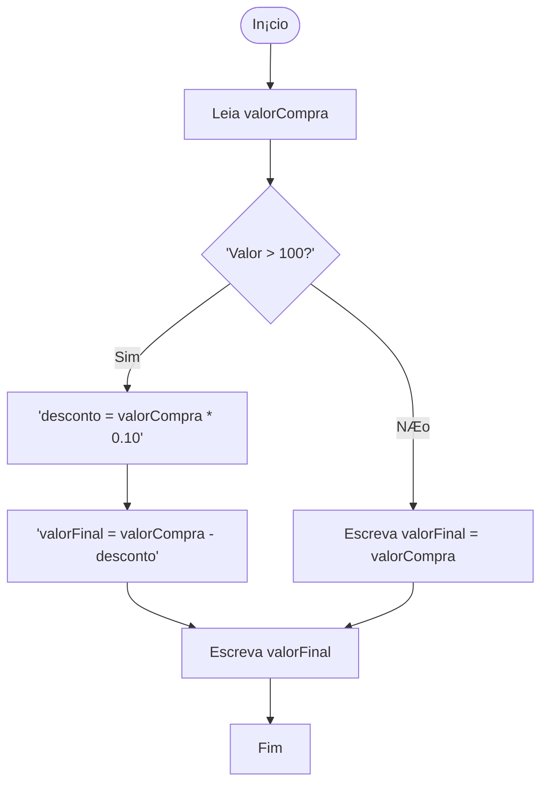

```mermaid
flowchart TD

A([In¡cio]) --> B[Leia valorCompra]

B --> C{'Valor > 100?'}

C -->|Sim| D['desconto = valorCompra * 0.10']
    
D --> E['valorFinal = valorCompra - desconto']  

C -->|NÆo| F[Escreva valorFinal = valorCompra]

E --> G[Escreva valorFinal] 
    
F --> G

G --> H[Fim]
```