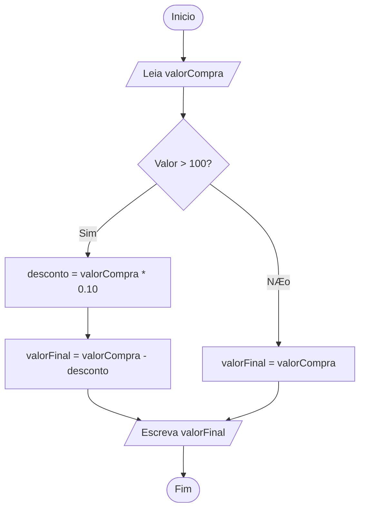

REQUEST HB_CODEPAGE_PT850

```mermaid
flowchart TD

A([Inicio]) --> B[/Leia valorCompra/]

B --> C{"Valor > 100?"}

C -->|Sim| D[desconto = valorCompra * 0.10]
    
D --> E[valorFinal = valorCompra - desconto]  

C -->|NÆo| F[valorFinal = valorCompra]

E --> G[/Escreva valorFinal/] 
    
F --> G

G --> H([Fim])
```